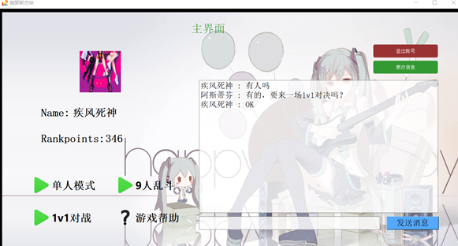
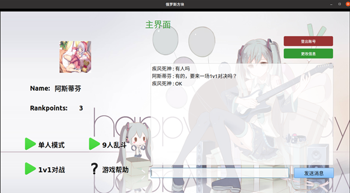
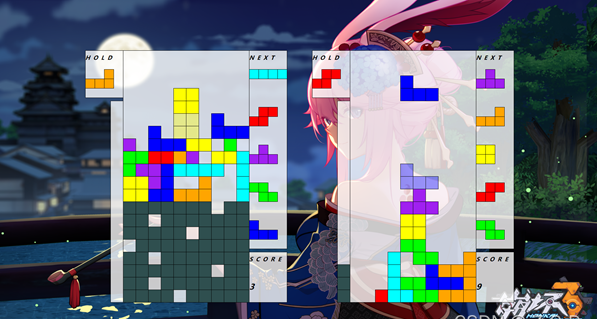
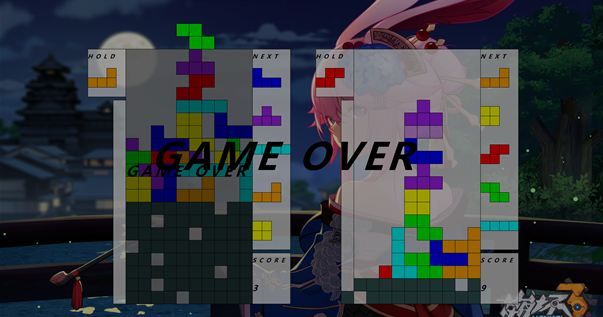
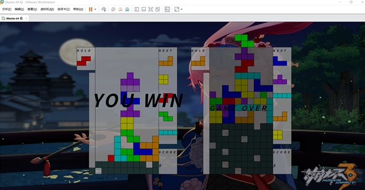
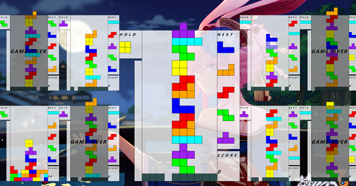
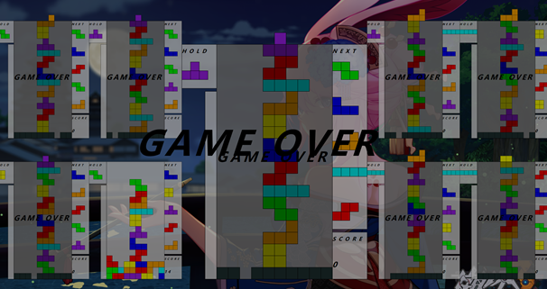
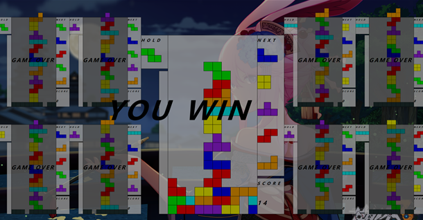
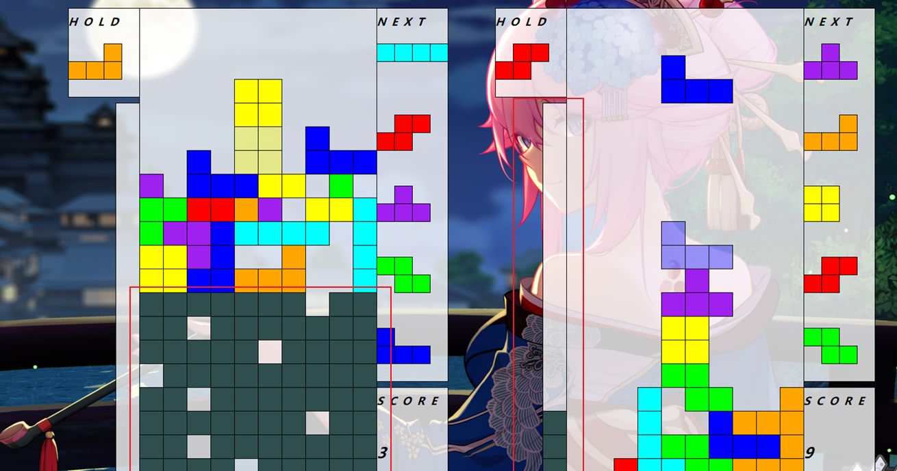

# Online-Tetris

跨平台多人联机的俄罗斯方块游戏，游戏规则模仿任天堂Tetris99，基于qt，kcp，protobuf，qslog。

## 游戏截图

### 游戏菜单

windows端游戏菜单



linux端游戏菜单



### 1v1对战

Windows游戏界面（左边为用户，右边为对手）



Windows方失败



Linux方胜利



### 9人对局

9人乱斗一方在累计伤害大于等于其他玩家人数的情况下向所有其他玩家发送一格黑块

游戏进行到中期玩家逐渐淘汰



9人模式中的败者



9人模式中的胜者



## 游戏特性细节介绍

### 攻击机制

附加了玩家之间可以相互攻击的新玩法特性。（模仿任天堂Tetris99）
具体规则如下

- 玩家一次消除1行至4行方块时将造成1，3，5，7点伤害。伤害（白色方块）加入受击槽（下图左边方框）中储存，槽中黑色方块为受到的伤害的缓存，白色方块造成伤害的缓存。存储的伤害（白色方块）大于等于存活的其他玩家数量时会消耗白色方块，往其他玩家的受击槽中添加一个黑色方块，这算作对其他玩家造成伤害，计入score得分。
- 受击槽中存在黑色方块时便开始计时，10秒黑色方块减半(向上取整)，减去的数量会使玩家的对局中的所有方块往上移动一格，并且在最下一行添加一行随机缺一个口的黑方块（左边玩家累计收到了九点伤害）

  

### Tetris标准特性

拥有[Tetris Guideline](https://harddrop.com/wiki/Tetris_Guideline)俄罗斯方块开发指南中现代俄罗斯方块游戏中的所有特性。
保持官方的这些特性有助于俄罗斯方块老玩家们有良好的操作手感的同时也给游戏带来了操作和策略性。

#### Super Rotation System（超级旋转系统）

当旋转后方块有部分卡在边界或者现有方块中时，游戏系统将尝试将方块“踢”入附近的其他位置，称为wall kick。
IOTSZJL表示方块类型，0,R,2,L 方块的四种方向
下面第一张图为官网给除的wallkick数据，第二张图的解释为当方块L从方向0逆时针转到方向L时，系统会依次对方块旋转后偏移（0,0),(+1,0),(+1,+1),(0,+2),(+1,-2)当有一个匹配成功则旋转成功，否则旋转失败。


#### 7 bag system （7袋系统）

方块的生成并不是完全随机的，而是每拿到7个方块每种方块（一共7个）必定会拿到一次。

#### hold piece （hold槽系统）

游戏需要有一个能暂时存放方块的hold box（盒子）来将目前的方块和hold box中的方块进行替换。（按s键）

#### soft drop（软降）

使方块加速下降。

#### hard drop（硬降）

使方块直线下降到底部并锁定。

#### ghost piece（幽灵方块）

用虚影显示当前方块硬降后的位置。

#### lock delay（延迟锁定）

当方块接触底部不会立即锁定，触底超过0.5秒锁定方块。

## 编译帮助

### msvc cmake build log

```bash
D:\Qt\Tools\CMake_64\bin\cmake.exe -DCMAKE_BUILD_TYPE=Release -G "CodeBlocks - NMake Makefiles" D:\ClionProject\Tetris
-- The C compiler identification is MSVC 19.26.28806.0
-- The CXX compiler identification is MSVC 19.26.28806.0
-- Detecting C compiler ABI info
-- Detecting C compiler ABI info - done
-- Check for working C compiler: C:/Program Files (x86)/Microsoft Visual Studio/2019/Community/VC/Tools/MSVC/14.26.28801/bin/Hostx64/x64/cl.exe - skipped
-- Detecting C compile features
-- Detecting C compile features - done
-- Detecting CXX compiler ABI info
-- Detecting CXX compiler ABI info - done
-- Check for working CXX compiler: C:/Program Files (x86)/Microsoft Visual Studio/2019/Community/VC/Tools/MSVC/14.26.28801/bin/Hostx64/x64/cl.exe - skipped
-- Detecting CXX compile features
-- Detecting CXX compile features - done
-- using Visual Studio C++
show_files: KCP_SRCS files: 1
-- D:/ClionProject/Tetris/3rd/kcp/ikcp.c
-- D:/Qt/5.15.2/msvc2019_64/bin/Qt5Core.dll
show_files: QSLOG_SRC files: 5
-- D:/ClionProject/Tetris/3rd/qslog/QsLog.cpp
-- D:/ClionProject/Tetris/3rd/qslog/QsLogDest.cpp
-- D:/ClionProject/Tetris/3rd/qslog/QsLogDestConsole.cpp
-- D:/ClionProject/Tetris/3rd/qslog/QsLogDestFile.cpp
-- D:/ClionProject/Tetris/3rd/qslog/QsLogDestFunctor.cpp
-- Found Protobuf: optimized;D:/protobuf-3.15.6/msvc_build/Release/libprotobuf.lib;debug;D:/protobuf-3.15.6/msvc_build/Debug/libprotobufd.lib (found version "3.15.6")
show_files: PROTO_SRCS files: 1
-- D:/ClionProject/Tetris/3rd/protobuf/tetris.pb.cc
show_files: SIMPLECRYPT_SRC files: 1
-- D:/ClionProject/Tetris/3rd/simplecrypt/simplecrypt.cpp
show_files: PROJECT_SRC files: 7
-- D:/ClionProject/Tetris/server/game.cpp
-- D:/ClionProject/Tetris/server/game.h
-- D:/ClionProject/Tetris/server/global.cpp
-- D:/ClionProject/Tetris/server/global.h
-- D:/ClionProject/Tetris/server/main.cpp
-- D:/ClionProject/Tetris/server/server.cpp
-- D:/ClionProject/Tetris/server/server.h
show_files: PROJECT_FILE files: 13
-- D:/ClionProject/Tetris/tetris/game.cpp
-- D:/ClionProject/Tetris/tetris/game.h
-- D:/ClionProject/Tetris/tetris/gamewindow.cpp
-- D:/ClionProject/Tetris/tetris/gamewindow.h
-- D:/ClionProject/Tetris/tetris/global.cpp
-- D:/ClionProject/Tetris/tetris/global.h
-- D:/ClionProject/Tetris/tetris/helpwindow.cpp
-- D:/ClionProject/Tetris/tetris/helpwindow.h
-- D:/ClionProject/Tetris/tetris/helpwindow.ui
-- D:/ClionProject/Tetris/tetris/main.cpp
-- D:/ClionProject/Tetris/tetris/mainwindow.cpp
-- D:/ClionProject/Tetris/tetris/mainwindow.h
-- D:/ClionProject/Tetris/tetris/mainwindow.ui
-- Configuring done
-- Generating done
-- Build files have been written to: D:/ClionProject/Tetris/cmake-build-release

[Finished]
```

### mingw cmake build log

```bash
"C:\Program Files\JetBrains\CLion 2021.2.3\bin\cmake\win\bin\cmake.exe" -DCMAKE_BUILD_TYPE=Release -DCMAKE_DEPENDS_USE_COMPILER=FALSE -G "CodeBlocks - MinGW Makefiles" D:\ClionProject\Tetris
-- The C compiler identification is GNU 8.1.0
-- The CXX compiler identification is GNU 8.1.0
-- Detecting C compiler ABI info
-- Detecting C compiler ABI info - done
-- Check for working C compiler: D:/Qt/Tools/mingw810_64/bin/gcc.exe - skipped
-- Detecting C compile features
-- Detecting C compile features - done
-- Detecting CXX compiler ABI info
-- Detecting CXX compiler ABI info - done
-- Check for working CXX compiler: D:/Qt/Tools/mingw810_64/bin/g++.exe - skipped
-- Detecting CXX compile features
-- Detecting CXX compile features - done
-- using GCC
show_files: KCP_SRCS files: 1
-- D:/ClionProject/Tetris/3rd/kcp/ikcp.c
-- D:/Qt/5.15.2/mingw81_64/bin/Qt5Core.dll
show_files: QSLOG_SRC files: 5
-- D:/ClionProject/Tetris/3rd/qslog/QsLog.cpp
-- D:/ClionProject/Tetris/3rd/qslog/QsLogDest.cpp
-- D:/ClionProject/Tetris/3rd/qslog/QsLogDestConsole.cpp
-- D:/ClionProject/Tetris/3rd/qslog/QsLogDestFile.cpp
-- D:/ClionProject/Tetris/3rd/qslog/QsLogDestFunctor.cpp
-- Found Protobuf: D:/protobuf-3.15.6/mingw_build/lib/libprotobuf.a (found version "3.15.6")
show_files: PROTO_SRCS files: 1
-- D:/ClionProject/Tetris/3rd/protobuf/tetris.pb.cc
show_files: SIMPLECRYPT_SRC files: 1
-- D:/ClionProject/Tetris/3rd/simplecrypt/simplecrypt.cpp
show_files: PROJECT_SRC files: 7
-- D:/ClionProject/Tetris/server/game.cpp
-- D:/ClionProject/Tetris/server/game.h
-- D:/ClionProject/Tetris/server/global.cpp
-- D:/ClionProject/Tetris/server/global.h
-- D:/ClionProject/Tetris/server/main.cpp
-- D:/ClionProject/Tetris/server/server.cpp
-- D:/ClionProject/Tetris/server/server.h
show_files: PROJECT_FILE files: 13
-- D:/ClionProject/Tetris/tetris/game.cpp
-- D:/ClionProject/Tetris/tetris/game.h
-- D:/ClionProject/Tetris/tetris/gamewindow.cpp
-- D:/ClionProject/Tetris/tetris/gamewindow.h
-- D:/ClionProject/Tetris/tetris/global.cpp
-- D:/ClionProject/Tetris/tetris/global.h
-- D:/ClionProject/Tetris/tetris/helpwindow.cpp
-- D:/ClionProject/Tetris/tetris/helpwindow.h
-- D:/ClionProject/Tetris/tetris/helpwindow.ui
-- D:/ClionProject/Tetris/tetris/main.cpp
-- D:/ClionProject/Tetris/tetris/mainwindow.cpp
-- D:/ClionProject/Tetris/tetris/mainwindow.h
-- D:/ClionProject/Tetris/tetris/mainwindow.ui
-- Configuring done
-- Generating done
-- Build files have been written to: D:/ClionProject/Tetris/cmake-build-release-mingw

[Finished]
```

## 游戏源码和发布程序

[github链接](https://github.com/rurcher/Online-Tetris)

## 声明

本项目只用于交流学习，其中的游戏音乐图片均来源于网络，如有侵权请联系删除。
